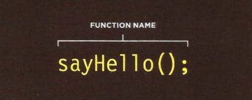

# ***Functions***
 ## _Functions let you group a series of statements together to perform a specific task. If different parts of a script repeat the same task, you can reuse the function (rather than repeating the same set of statements)._

## ***BASIC FUNCTION:***

*In this example, the user is shown a message at the top of the pa/ge. The message is held in an HTML element whose id attribute has a value of message. The message is going to be changed using JavaScript.
Before the closing  ``</body> `` tag , you can see the link to the JavaScript file. The JavaScript file starts with a variable used to hold a new message, and is followed by a function called updateMessage().*

 

## ***DECLARING A FUNCTION***
*To create a function, you give it a name and then write the statements needed to achieve its task inside the curly braces.  This is known as a function declaration.*

*You declare a function using the function keyword.  You give the function a name (sometimes called an identifier) followed by parentheses.  The statements that perform the task sit in a code block.  (They are inside curly braces.)*

## ***CALLING A FUNCTION***
*Having declared the function, you can then execute all of the statements between its curly braces with just one line of code.  This is known as calling the function.*

*To run the code in the function, you use the function name followed by parentheses.  In programmer - speak, you would say that this code calls a function.  You can call the same function as many times as you want within the same JavaScript file.*

### ***DECLARING FUNCTIONS THAT NEED INFORMATION ***
 *Sometimes a function needs specific information to perform its task.  In such cases, when you declare the function you give it parameters.  Inside the function, the parameters act like variables.*

 *If a function needs information to work, you indicate what it needs to know in parentheses after the function name.  The items that appear inside these parentheses are known as the parameters of the function.  Inside the function those words act like variable names.*

### ***CALLING FUNCTIONS THAT NEED INFORMATION ***
*When you call a function that has parameters, you specify the values it should use in the parentheses that follow its name.  The values are called arguments, and they can be provided as values or as variables.*

### ***GETTING A SINGLE VALUE OUT OF A FUNCTION ***

*Some functions return information to the code that called them.  For example, when they perform a calculation, they return the result.*

### ***GETTING MULTIPLE VALUES OUT OF A FUNCTION***

*Functions can return more than one value using an array.  For example, this function calculates the area and volume of a box.*

[Back to homepage](./mainpage.md)

