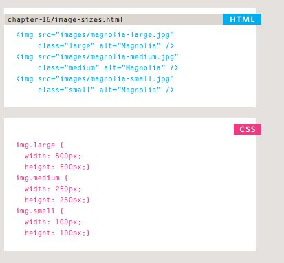
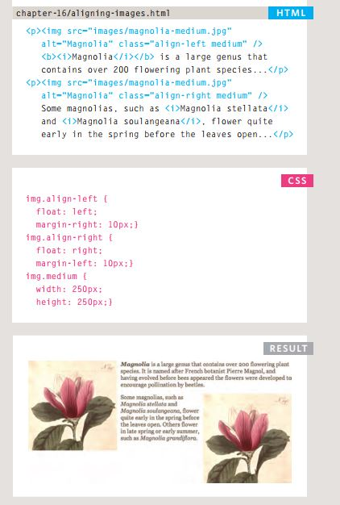
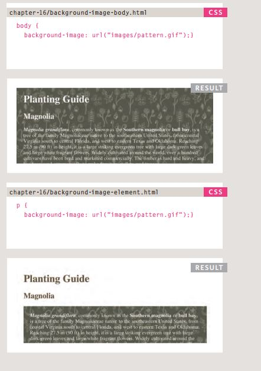
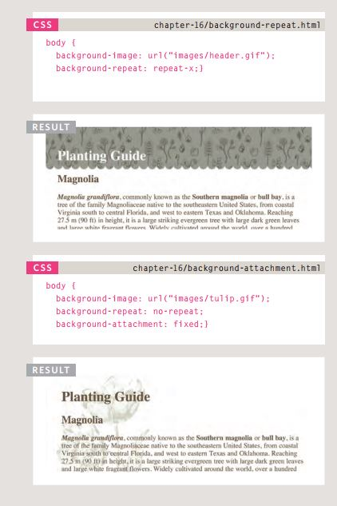
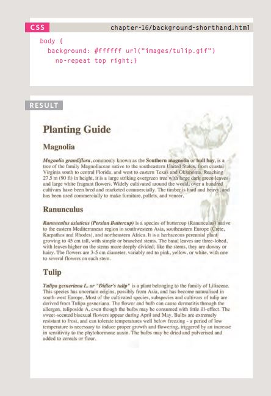
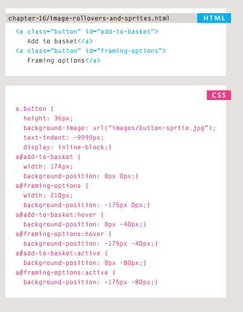
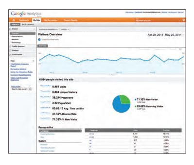
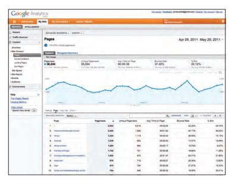
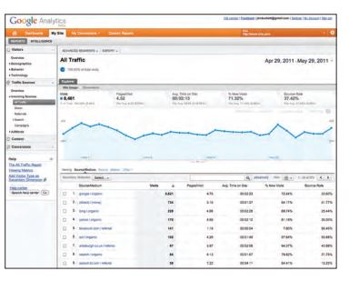
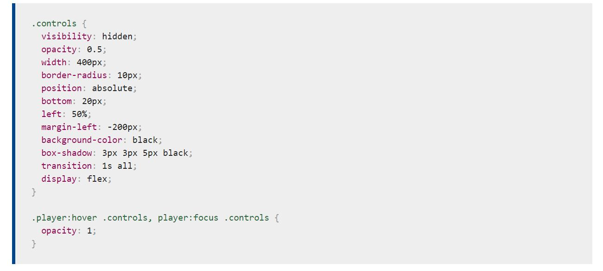

# *Images & Practical Information.*


##  Images:
- **Controlling sizes of images in CSS:**

<br>


<br>

- **Aligning images in CSS:**
<br>


<br>

- **BackgroUnd Images:**

<br>


<br>

- **Repeating Images:**
<br>


<br>


- **Shorthand Background:**

<br>


<br>


- **Image Rollovers & sprites:**


<br>


<br>


# **Practical Information**

SEO is a huge topic and several books have been written on the subject.
The following pages will help you understand the key concepts so you can
improve your website's visibility on search engines.


- **How to identify
keyWords and Phrases:**

Determining which keywords to use on your site can be one of the
hardest tasks when you start to think about SEO. Here are six steps that
will help you identify the right keywords and phrases for your site.

1. Brainstorm.
1. Organize.
1. Research.
1. Compare.
1. Refine.
1. Map.


- **analytics: learning
aBout your Visitors**

As soon as people start coming to your site, you can start analyzing
how they found it, what they were looking at and at what point they are
leaving. One of the best tools for doing this is a free service offered by
Google called Google Analytics.

1. Signing up.
1. How it works.
1. The tracking Code.


- **HoW many PeoPle are
coming to your site?**

The overview page gives you a snapshot of the key information you are
likely to want to know. In particular, it tells you how many people are
coming to your site.


<br>


<br>


- **What are your Visitors
looking at?**

The content link on the left-hand side allows
you to learn more about what the visitors are
looking at when they come to your site.

<br>


<br>

- **Where are your
Visitors coming from?**

The traffic sources link on the left hand side
allows you to learn where your visitors are
coming from.

<br>


<br>


## *Video and Audio APIs*

The `<video>` and `<audio>` elements allow us to embed video and audio into web pages. As we showed in Video and audio content, a typical implementation looks like this:

<br>


<br>

**Exploring the HTML
Open the HTML index file. You'll see a number of features; the HTML is dominated by the video player and its controls:**


<br>


<br>


**Exploring the CSS
Now open the CSS file and have a look inside. The CSS for the example is not too complicated, but we'll highlight the most interesting bits here. First of all, notice the ```.controls``` styling:**

<br>


<br>


[Back to homepage](//README.md)