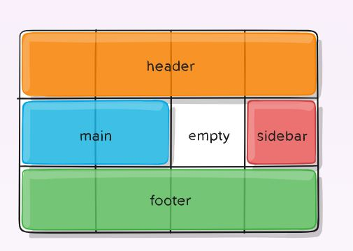

# CSS Grid
 CSS grid lets us not only arrange elements in a row or a column, but in multiple rows and columns. Finally two dimensional layouts are becoming simpler!

## Properties for the Parent (Grid Container):

- `display`:
Defines the element as a grid container and establishes a new grid formatting context for its contents.
Values:

  - grid – generates a block-level grid.
  - inline-grid – generates an inline-level grid.

- `grid-template-columns`,
`grid-template-rows`:

Defines the columns and rows of the grid with a space-separated list of values. The values represent the track size, and the space between them represents the grid line.

  - `track-size` – can be a length, a percentage, or a fraction of the free space in the grid (using the fr unit).
 - `line-name` – an arbitrary name of your choosing.

- `grid-template-areas`:
Defines a grid template by referencing the names of the grid areas which are specified with the grid-area property. Repeating the name of a grid area causes the content to span those cells. A period signifies an empty cell. The syntax itself provides a visualization of the structure of the grid.
 values:

 - `grid-area-name` – the name of a grid area specified with grid-area.
 - `.` – a period signifies an empty grid cell.
 - `none` – no grid areas are defined.

 Example:
 

 

 

 - `grid-template`
A shorthand for setting `grid-template-rows`, `grid-template-columns`, and `-grid-template-areas` in a single declaration.

Values:

- `none` – sets all three properties to their initial values
`grid-template-rows` / `grid-template-columns` – sets grid-template-columns and grid-template-rows to the specified values, respectively, and sets grid-template-areas to none.

Here is some of Grid properties, also you can read more about Grid while going through these useful websites: 
- ***[css tricks](https://css-tricks.com/snippets/css/complete-guide-grid/)***
- ***[Grid Garden game](https://cssgridgarden.com/)***
