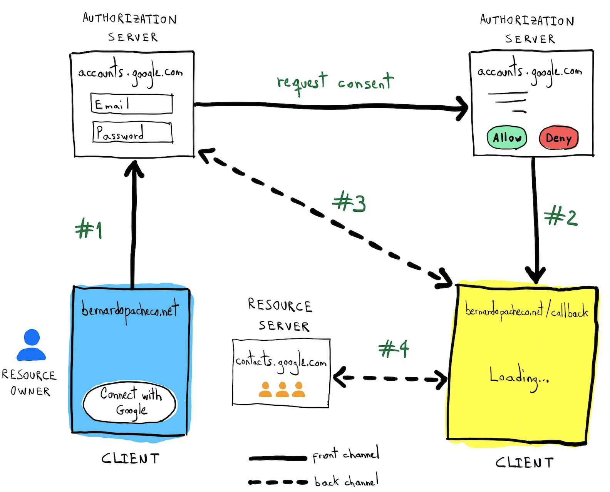

# O Auth


### OAuth 
is a delegated authorization framework for REST/APIs. It enables apps to obtain limited access (scopes) to a user's data without giving away a user's password. It decouples authentication from authorization and supports multiple use cases addressing different device capabilities<br>

The first step of OAuth 2 is to get authorization from the user. For browser-based or mobile apps, this is usually accomplished by displaying an interface provided by the service to the user.<br>

<br>



<br>


OAuth 2 provides several "grant types" for different use cases. The grant types defined are:<br>

- Authorization Code for apps running on a web server, browser-based and mobile apps.<br>
- Password for logging in with a username and password (only for first-party apps).<br>
- Client credentials for application access without a user present.<br>
- Implicit was previously recommended for clients without a secret, but has been superseded by using the Authorization Code grant with PKCE.<br>

#### Password
OAuth 2 also provides a "password" grant type which can be used to exchange a username and password for an access token directly. Since this obviously requires the application to collect the user's password, it must only be used by apps created by the service itself. For example, the native Twitter app could use this grant type to log in on mobile or desktop apps.

To use the password grant type, simply make a POST request like the following:

```
POST https://api.authorization-server.com/token
  grant_type=password&
  username=USERNAME&
  password=PASSWORD&
  client_id=CLIENT_ID
  ```

- grant_type=password - The grant type for this flow is password.
- username=USERNAME - The user's username as collected by the application.
- password=PASSWORD - The user's password as collected by the application.
- client_id=CLIENT_ID - The client ID you received when you first created the application.

The server replies with an access token in the same format as the other grant types.

### Differences from OAuth 1.0
OAuth 1.0 was largely based on existing proprietary protocols such as Flickr's "FlickrAuth" and Google's "AuthSub". The result represented the best solution based on actual implementation experience. However, after several years of working with the protocol, the community learned enough to rethink and improve the protocol in three main areas where OAuth 1.0 proved limited or confusing.
